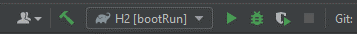
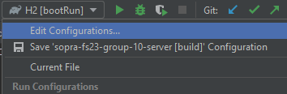
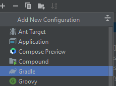
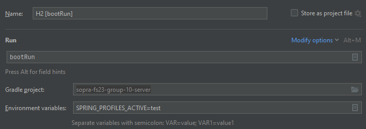
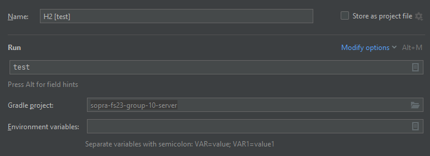
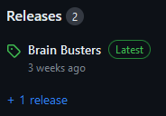
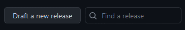
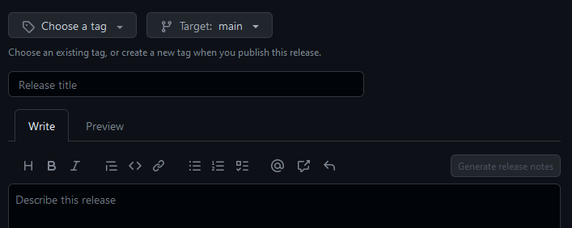
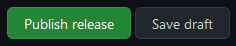

# BrainBusters 

## Table of Content

- [Introduction](#introduction)
- [Built With](#built-with)
- [Main Components](#main-components)
- [Launch](#launch)
- [Deployment](#deployment)
- [Roadmap](#roadmap)
- [Authors & Acknowledgments](#authors--acknowledgments)
- [License](#license)

## Introduction

Brain Busters is a trivia game designed to entertain and educate players on a wide range of topics, from history and geography to pop culture and sports. It provides a solution to the problem of limited entertainment and educational options for people seeking to learn, have fun, connect with others, and maybe even discover new interests.  

The game stands out for its various game modes. The classic trivia game offers a traditional style of gameplay, while the image mode gradually reveals blurry pictures. Both modes challenge players on quick decision-making. The facts are accessed and updated using an API, keeping the game up-to-date and accurate.  

Next to the single mode, the tournament mode adds an exciting element of competition, allowing players to participate in a bracket-style tournament, creating a more dynamic and engaging experience, as players can track their progress and compete for the ultimate title of Brain Busters champion.

## Built With

* [React](https://react.dev/) - Front-end JavaScript library concerning the user interface
* [Spring](https://spring.io/projects/spring-framework) - Framework that enables running JVM
* [Gradle](hhttps://gradle.org/) - Build automation tool
* [STOMP](https://stomp-js.github.io/stomp-websocket/) - Used for Websockets
* [The Trivia API](https://the-trivia-api.com/) - API for text questions
* [Mailjet API](https://www.mailjet.com/) - For sending mails

## Main Components

### User
The [User](https://github.com/sopra-fs23-group-10/sopra-fs23-group-10-server/blob/main/src/main/java/ch/uzh/ifi/hase/soprafs23/entity/User.java)
entity is a core part of BrainBuster, since else in order to participate in a game one has to be able to log in, log out and getting their achieved points.
Additionally, an important factor is that one gets recognized and is able to keep the points in their game und thus being able to compare their rank/effort with other users.

### UserController
The [UserController](https://github.com/sopra-fs23-group-10/sopra-fs23-group-10-server/blob/main/src/main/java/ch/uzh/ifi/hase/soprafs23/controller/UserController.java)
handles requests from the front-end regarding users and fulfills their requests.

### Game
The [Game](https://github.com/sopra-fs23-group-10/sopra-fs23-group-10-server/blob/main/src/main/java/ch/uzh/ifi/hase/soprafs23/entity/Game.java)
entity is a crucial part of BainBusters since without a game the users would not be able to play and obtain their points.
Nor being able to retrieve the appropriate questions.

### GameController
The [GameController](https://github.com/sopra-fs23-group-10/sopra-fs23-group-10-server/blob/main/src/main/java/ch/uzh/ifi/hase/soprafs23/controller/GameController.java)
responds to requests from the front-end regarding Games and fulfills their requests.

### Websockets
The [Websockets](https://github.com/sopra-fs23-group-10/sopra-fs23-group-10-server/tree/main/src/main/java/ch/uzh/ifi/hase/soprafs23/websockets)
enables to directly inform the client from the server.

## Launch

### Getting Started
These instructions will get you a copy of the project up and running on your local machine for development and testing purposes. See [deployment](#deployment) for notes on how to deploy the project on a live system.

Clone the client-repository onto your local machine with the help of [Git](https://git-scm.com/downloads).

```git clone https://github.com/sopra-fs23-group-10/sopra-fs23-group-10-server.git```

### IntelliJ
1. "File" -> "Open..." -> sopra-fs23-group-10-server
2. Accept to import the project as a `gradle project`
3. To build right-click the `build.gradle` file and choose `Run Build`

### VS Code
The following extensions can help you get started more easily:
-   `vmware.vscode-spring-boot`
-   `vscjava.vscode-spring-initializr`
-   `vscjava.vscode-spring-boot-dashboard`
-   `vscjava.vscode-java-pack`

### Building with Gradle
You can use the local Gradle Wrapper to build the application.
-   macOS: `./gradlew`
-   Linux: `./gradlew`
-   Windows: `./gradlew.bat`

More Information about [Gradle Wrapper](https://docs.gradle.org/current/userguide/gradle_wrapper.html) and [Gradle](https://gradle.org/docs/).

#### Build
```bash
./gradlew build
```

### Setup Run Configurations
1. To set up the run configuration go to the right top corner and select the dropdown menu.<br>
   
2. Click on "Edit Configurations...".<br>
   
3. On the new pop-up window click on the left top side on the "+" and select "Gradle".<br>
   
4. In the Run field write `bootRun`.
5. In the Environment variables field write `SPRING_PROFILES_ACTIVE=test`.<br>

6. Write an appropriate name into the Name field.
7. If everything is correct click on the button "Apply" in the right bottom corner.
8. Validate your changes by clicking on the button "ok" on the right bottom.

You can verify that the server is running by visiting `localhost:8080` in your browser.

### Setup Test Configurations
1. To set up the run configuration go to the right top corner and select the dropdown menu.<br>
   
2. Click on "Edit Configurations...".<br>
   
3. On the new pop-up window click on the left top side on the "+" and select "Gradle".<br>
   
4. In the Run field write `test`.<br>
   
5. Write an appropriate name into the Name field.
6. If everything is correct click on the button "Apply" in the right bottom corner.
7. Validate your changes by clicking on the button "ok" on the right bottom.

### API Endpoint Testing with Postman
We recommend using [Postman](https://www.getpostman.com) to test your API Endpoints.

### Debugging
If something is not working and/or you don't know what is going on. We recommend using a debugger and step-through the process step-by-step.

To configure a debugger for SpringBoot's Tomcat servlet (i.e. the process you start with `./gradlew bootRun` command), do the following:

1. Open Tab: **Run**/Edit Configurations
2. Add a new Remote Configuration and name it properly
3. Start the Server in Debug mode: `./gradlew bootRun --debug-jvm`
4. Press `Shift + F9` or the use **Run**/Debug "Name of your task"
5. Set breakpoints in the application where you need it
6. Step through the process one step at a time

## Deployment

Once your changes are pushed onto the main branch, they automatically get deployed onto Google Cloud.

### Create Releases
1. Navigate to the main page of the repository and click on the right of the page on "Releases".<br>
   
2. On the new page click on "Draft a new release".<br>
   
3. Choose an appropriate tag with the dropdown menu or create a new one.
4. Choose the appropriate branch that you want to release (main branch).
5. Write an appropriate title for the release in the "Release title" field.
6. Write an appropriate description in the "Describe this release" field or click on "Generate release notes" to autogenerate the description.<br>
   
7. If everything is correct and can be released, press the button at the bottom "Publish release".<br>
   

## Roadmap

Features that new developers who want to contribute to our project could add.

- new Game mode music quiz.<br>
- convert to iOS & Android native app.
- add new records to our image database.

## Authors & Acknowledgments

### Authors
* **Sarah Egger** - *Initial work* - [saeie07](https://github.com/saeie07)
* **Linn Spitz** - *Initial work* - [ringdinglinn](https://github.com/ringdinglinn)
* **Patrick Widmer** - *Initial work* - [Chopstew](https://github.com/Chopstew)
* **Sandrin Hunkeler** - *Initial work* - [Altishofer](https://github.com/Altishofer)
* **Cédric Lüchinger** - *Initial work* - [dattes](https://github.com/dattes)

### Acknowledgments
We would like to thank our tutor [jemaie](https://github.com/jemaie) and the whole team of the module Software Engineering Lab from the University of Zurich.

## License

This project is licensed under the Apache License 2.0 - see the [LICENSE](https://github.com/sopra-fs23-group-10/sopra-fs23-group-10-server/blob/main/LICENSE) file for details.
